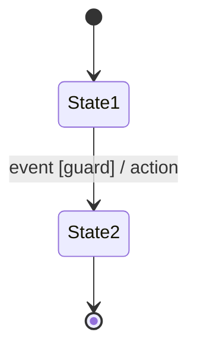
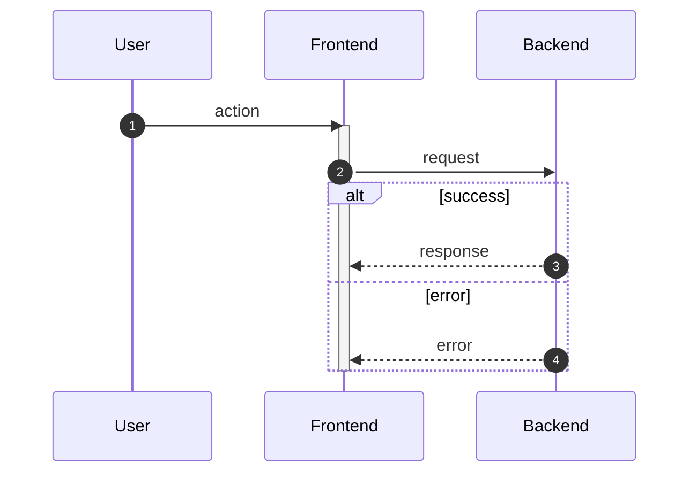

# Generate Application Diagrams

This skill guides creation of comprehensive state machine and sequence diagrams that capture all application logic, data flows, and system interactions. Exhaustively analyze the codebase—be thorough, not lazy.

**Recommended:** For fresh context, use the `diagram-generator` agent (Opus model).

## Critical Constraint: Document Only What Exists

**You must diagram the application exactly as it is currently implemented.**

- Only document states, flows, and behaviors that exist in the current code
- Do NOT invent states or transitions that "should" exist
- Do NOT add error handling that isn't implemented
- Do NOT diagram planned features or TODO items
- Do NOT assume functionality exists because it would be "best practice"
- If something is missing or incomplete in the code, document what IS there, not what ought to be

If you observe gaps, missing error handling, or incomplete flows in the implementation, you may add a brief note in that diagram file under a `## Observations` section—but the diagrams themselves must reflect only the actual implementation.

---

## Phase 1: Discovery (Required First Step)

**IMPORTANT: Create the inventory file BEFORE creating any diagrams.**

Build a complete inventory by reading the actual code, then write it to `docs/diagrams/_inventory.md`.

### Inventory Categories

1. **Frontend inventory**: All routes, views, components with state
2. **Backend inventory**: All endpoints, services, handlers
3. **Data inventory**: All entities, models, their relationships
4. **Integration inventory**: All external services, APIs, dependencies
5. **Background processes**: All jobs, scheduled tasks, async workflows
6. **Auth/security inventory**: All protected resources, permission levels, crypto operations

### Inventory File Template

Create `docs/diagrams/_inventory.md` with this structure:

```markdown
# Application Inventory

Generated: [date]
Commit: [git commit hash]

## Frontend

### Routes/Pages
- [ ] `/path` - description
- [ ] `/path/:id` - description

### Components with State
- [ ] `ComponentName` - description

## Backend

### Endpoints
- [ ] `GET /api/resource` - description
- [ ] `POST /api/resource` - description

### Services/Handlers
- [ ] `ServiceName` - description

## Data

### Entities/Models
- [ ] `EntityName` - fields, relationships

## Integrations

### External Services
- [ ] `ServiceName` - purpose

## Background Processes

### Jobs/Tasks
- [ ] `JobName` - schedule, purpose

## Auth/Security

### Protected Resources
- [ ] `Resource` - permission level

### Crypto Operations
- [ ] `Operation` - purpose

---

## Coverage Tracking

Mark items with diagram references as you create them:
- [x] `/login` - `auth/login-flow.md`
- [ ] `/dashboard` - (pending)
```

**Do not proceed to Phase 2 until this inventory file is created.**

---

## Phase 2: Diagram Creation

### State Machine Diagrams (Mermaid stateDiagram-v2)

Must capture:
- All application states and valid transitions as implemented
- Authentication and session states
- Per-feature/entity lifecycle states
- Async operation states (loading, error, success patterns)
- Nested states for complex features
- Error states and recovery paths that actually exist in the code

Format:


### Sequence Diagrams (Mermaid sequenceDiagram)

Must capture:
- All user journeys from action to completion as implemented
- All participants: User, Frontend, Backend, Database, External Services
- Request/response flows with activation boxes
- Alternative paths (`alt`), optional paths (`opt`), loops (`loop`)
- Error handling and propagation that exists in the code
- Background/scheduled process flows

Format:


---

## Phase 3: Organization

You decide how to logically group and structure the diagrams based on what makes sense for this specific codebase. Consider organizing by:

- **Feature/domain boundaries** (e.g., auth, payments, messaging)
- **User journey flows** (e.g., onboarding, core workflow, settings)
- **Technical layers** (e.g., frontend states, backend processes, integrations)
- **Complexity levels** (e.g., overview diagrams → detailed breakdowns)
- **Any other logical grouping that fits this project**

**Requirements for your chosen organization:**

1. **Explain your structure** - Before creating diagrams, describe how you've chosen to organize them and why it fits this codebase
2. **Create an index** - Provide a README that maps the structure and helps navigate between diagrams
3. **Ensure complete coverage** - Cross-reference against your discovery inventory; every item must be covered
4. **Keep diagrams readable** - Split into multiple diagrams when a single diagram becomes too complex; aim for clarity over completeness in any single diagram
5. **Link related diagrams** - Note connections between diagrams (e.g., "see auth-flow.md for login sequence")

---

## Output Structure

```
docs/diagrams/
├── README.md          # Index explaining organization, linking all diagrams
├── _inventory.md      # Discovery checklist with coverage tracking
├── [your-logical-grouping]/
│   ├── [diagram-name].md
│   └── ...
└── ...
```

### Required Files

**MUST create these files:**

1. `docs/diagrams/_inventory.md` - Created in Phase 1 (before diagrams)
2. `docs/diagrams/README.md` - Created in Phase 3 (after diagrams)

### README.md Template

Create `docs/diagrams/README.md` with this structure:

```markdown
# Application Diagrams

Visual documentation of application architecture, state machines, and interaction flows.

Generated: [date]
Commit: [git commit hash]

## Organization

[Explain how diagrams are organized and why this structure fits the codebase]

## Diagram Index

### [Category/Feature 1]
| Diagram | Type | Description |
|---------|------|-------------|
| [name.md](path/name.md) | State Machine | Description |
| [name.md](path/name.md) | Sequence | Description |

### [Category/Feature 2]
| Diagram | Type | Description |
|---------|------|-------------|
| [name.md](path/name.md) | State Machine | Description |

## How to Read These Diagrams

- **State Machines**: Show all possible states and transitions
- **Sequence Diagrams**: Show interaction flows between components

## Related Files

- [_inventory.md](_inventory.md) - Complete component inventory with coverage tracking
```

### Diagram File Structure

Each diagram file should contain:
1. Brief description of scope and context
2. The Mermaid diagram(s)
3. Notes on edge cases or non-obvious behaviors (as implemented)
4. Cross-references to related diagrams
5. (Optional) `## Observations` section for noting gaps—separate from the diagrams

---

## Mermaid Syntax Guidelines (Prevent Rendering Errors)

### ⚠️ CRITICAL: Never Use These Words Anywhere

**`Actor`** - This keyword cannot appear anywhere, even as a label!
```mermaid
# WRONG - will break
participant Actor
participant A as Actor

# CORRECT - avoid the word entirely
participant U as User
participant B as Backend
participant UserActor
participant BackendActor
```

**`End`** - This keyword cannot be used as-is!
```mermaid
# WRONG
State1 --> End
state "End" as End

# CORRECT - capitalize or rephrase
State1 --> END
State1 --> EndState
State1 --> Completed
state "End State" as EndState
```

### Common Errors to Avoid

**1. Special characters in labels must be quoted or avoided:**
```mermaid
# BAD - will break
State1 --> State2 : user clicks "submit"

# GOOD - rephrase without quotes
State1 --> State2 : user clicks submit button
```

**2. Avoid parentheses in state/participant names:**
```mermaid
# BAD
participant Auth(Service)

# GOOD
participant AuthService as Auth Service
```

**3. Colons in labels need careful handling:**
```mermaid
# BAD
A --> B : error: invalid input

# GOOD
A --> B : error - invalid input
```

**4. State names must be valid identifiers (no spaces, start with letter):**
```mermaid
# BAD
stateDiagram-v2
    User Logged In --> Dashboard

# GOOD
stateDiagram-v2
    UserLoggedIn --> Dashboard
    state "User Logged In" as UserLoggedIn
```

**5. Sequence diagram arrows:**
```
Solid arrow (request): ->>
Dotted arrow (response): -->>
```

**6. Always close activate/deactivate pairs:**
```mermaid
# BAD - missing deactivate
activate B
B->>C: call

# GOOD
activate B
B->>C: call
deactivate B
```

**7. Alt/opt/loop blocks must be properly closed:**
```mermaid
alt success case
    B-->>A: 200 OK
else error case
    B-->>A: 500 Error
end
```

**8. Avoid reserved words as identifiers:**
Do not use these as state/node/participant names:

**Sequence diagram:** `participant`, `actor`, `as`, `activate`, `deactivate`, `note`, `left of`, `right of`, `over`, `alt`, `else`, `opt`, `loop`, `par`, `and`, `critical`, `break`, `rect`, `end`, `autonumber`, `link`, `links`, `create`, `destroy`, `box`

**State diagram:** `state`, `as`, `note`, `direction`, `classDef`, `class`, `end`

Use alternatives - avoid the keyword entirely:
```mermaid
# BAD - Actor is a keyword
participant Actor
participant A as Actor

# GOOD - avoid "Actor" completely
participant U as User
participant UserActor

# BAD - End is a keyword
State1 --> End

# GOOD - capitalize or rephrase
State1 --> END
State1 --> Completed
state "End State" as EndState
```

**9. Keep labels concise:**
Long labels can cause rendering issues. Break complex descriptions into notes instead.

### Validation Process

After creating each diagram:

1. **Syntax check**: Review for the common errors listed above
2. **Structure check**: Ensure all blocks (alt/opt/loop/activate) are properly closed
3. **Identifier check**: Verify state/participant names are valid identifiers
4. **Test render** (if available):
   ```bash
   # Use mmdc directly if installed
   mmdc -i diagram.md -o test.svg

   # Or via npx if not in path
   npx -y @mermaid-js/mermaid-cli mmdc -i diagram.md -o test.svg
   ```

---

## Verification Checklist

Before completion, verify:

### Accuracy
- [ ] Every diagram reflects only what is actually implemented
- [ ] No invented or assumed functionality is included
- [ ] States and transitions can be traced to specific code locations

### Required Files
- [ ] `docs/diagrams/_inventory.md` exists and is complete
- [ ] `docs/diagrams/README.md` exists with diagram index

### Inventory Coverage
- [ ] Every item from discovery inventory appears in at least one diagram
- [ ] Every backend endpoint is traced in a sequence diagram
- [ ] Every frontend route/view has state coverage
- [ ] Every entity lifecycle is documented
- [ ] Inventory items are marked with diagram references

### Diagram Quality
- [ ] Each diagram is readable without excessive complexity
- [ ] Complex flows are broken into logical sub-diagrams
- [ ] Naming is consistent across all diagrams
- [ ] Cross-references link related diagrams

### Mermaid Syntax (must pass to complete)
- [ ] No special characters in unquoted labels
- [ ] All state/participant names are valid identifiers
- [ ] All activate/deactivate pairs are closed
- [ ] All alt/opt/loop blocks are properly closed
- [ ] No reserved words used as identifiers (actor, end, state, note, participant, loop, alt, opt, rect, critical, break, par, and, else)
- [ ] Diagrams validated via test render or manual review

### Edge Cases (as implemented)
- [ ] Error handling paths that exist are documented
- [ ] Timeout and retry logic that exists is included
- [ ] Concurrent operation handling that exists is addressed

### Traceability
- [ ] Any user story can be traced through the diagrams
- [ ] State diagrams and sequence diagrams are consistent with each other
- [ ] Diagram elements can be mapped back to source code
