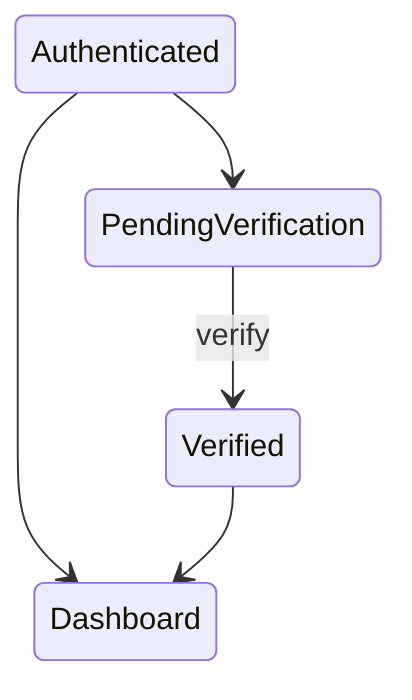
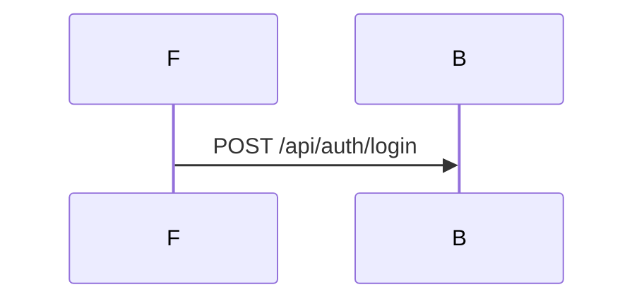

# Update Application Diagrams

This skill guides incremental updates to existing diagrams after code changes. Detect what changed, identify affected diagrams, and apply precise updates—be surgical, not wasteful.

**Prerequisites:** Existing diagrams from `generate-app-diagrams` skill, including `docs/diagrams/_inventory.md`.

**Recommended:** For fresh context, use the `diagram-updater` agent (Opus model).

---

## Phase 1: Change Detection

Detect what changed using both git and inventory comparison.

### Git-Based Detection

```bash
# Find files changed since diagrams were last updated
# Use the _inventory.md modification time as reference
git diff --name-only $(git log -1 --format=%H -- docs/diagrams/_inventory.md) HEAD

# Or if tracking specific commit in diagrams
git diff --name-only <last-diagram-commit> HEAD
```

Categorize changed files:
- **Frontend changes**: Routes, components, views, state management
- **Backend changes**: Endpoints, services, handlers, models
- **Integration changes**: External APIs, database schemas
- **Auth/security changes**: Permission logic, authentication flows

### Inventory-Based Detection

Compare `docs/diagrams/_inventory.md` against current codebase:

1. **Read existing inventory** from `docs/diagrams/_inventory.md`
2. **Scan current codebase** for all components (same process as generate skill)
3. **Compare to identify:**
   - **Added**: Components in codebase but not in inventory
   - **Removed**: Components in inventory but not in codebase
   - **Modified**: Components that exist but have changed (via git diff)

Output a change report:
```markdown
## Change Report

### Added Components
- [ ] `POST /api/users/verify` - new endpoint
- [ ] `VerificationModal` - new component

### Removed Components
- [ ] `GET /api/legacy/auth` - endpoint removed
- [ ] `OldLoginForm` - component deleted

### Modified Components
- [ ] `AuthService` - significant changes
- [ ] `UserDashboard` - state logic updated
```

---

## Phase 2: Impact Analysis

Determine which diagrams need updates.

### Map Changes to Diagrams

For each changed component, identify affected diagrams:

1. **Read diagram index** from `docs/diagrams/README.md`
2. **Search each diagram** for references to changed components
3. **Build impact map:**

```markdown
## Impact Analysis

### Diagrams Requiring Updates
| Diagram | Reason | Priority |
|---------|--------|----------|
| `auth/login-flow.md` | AuthService modified | High |
| `auth/session-state.md` | New verification step | High |
| `user/dashboard-sequence.md` | UserDashboard changes | Medium |

### Diagrams Unaffected
- `payments/checkout-flow.md` - no related changes
- `settings/preferences-state.md` - no related changes
```

### Priority Classification

- **High**: Core flow changes, security changes, breaking changes
- **Medium**: Feature additions, UI state changes
- **Low**: Minor modifications, cosmetic changes

---

## Phase 3: Incremental Updates

Update only affected diagrams.

### Update Process

For each affected diagram:

1. **Read current diagram** and understand its scope
2. **Read changed code** for components in that diagram
3. **Identify specific changes:**
   - New states/transitions to add
   - Removed states/transitions to delete
   - Modified labels or flows to update
4. **Apply changes** while preserving unchanged parts
5. **Validate Mermaid syntax** after changes

### Update Patterns

**Adding new states/transitions:**


**Removing deprecated flows:**


**Modifying existing flows:**
```mermaid
%% UPDATED: Changed from sync to async
F->>B: POST /api/process
activate B
B-->>F: 202 Accepted (was 200 OK)
B--)F: WebSocket: processing complete
deactivate B
```

---

## Phase 4: Update Inventory

Sync `docs/diagrams/_inventory.md` with current codebase.

1. **Add new components** discovered in change detection
2. **Remove deleted components** no longer in codebase
3. **Update modification timestamps** or commit references
4. **Mark coverage** for new components

```markdown
## Updated Inventory

### Frontend Routes
- [x] `/dashboard` - dashboard-state.md
- [x] `/settings` - settings-state.md
- [x] `/verify` - **NEW** - auth/verification-flow.md ⬅️ Added

### Backend Endpoints
- [x] `POST /api/auth/login` - auth/login-flow.md
- [x] `POST /api/users/verify` - **NEW** - auth/verification-flow.md ⬅️ Added
- [ ] ~~`GET /api/legacy/auth`~~ - **REMOVED** ⬅️ Deleted
```

---

## Phase 5: Consistency Verification

Ensure updates maintain consistency across all diagrams.

### Cross-Reference Check

1. **State consistency**: States referenced in sequences exist in state machines
2. **Participant consistency**: Participants match across related diagrams
3. **Flow consistency**: Transitions align between diagrams
4. **Naming consistency**: Same components use same names everywhere

### Mermaid Syntax Validation

**⚠️ CRITICAL: These words CANNOT appear anywhere (even as labels):**
- `Actor` → use `User`, `Backend`, `UserActor`, `BackendActor` instead
- `End` → use `END`, `Completed`, `EndState` instead

**All reserved words to avoid:**
- **Sequence:** `participant`, `actor`, `as`, `activate`, `deactivate`, `note`, `left of`, `right of`, `over`, `alt`, `else`, `opt`, `loop`, `par`, `and`, `critical`, `break`, `rect`, `end`, `autonumber`, `link`, `links`, `create`, `destroy`, `box`
- **State:** `state`, `as`, `note`, `direction`, `classDef`, `class`, `end`

Validate all updated diagrams:
```bash
# Use mmdc directly if installed
mmdc -i updated-diagram.md -o test.svg

# Or via npx
npx -y @mermaid-js/mermaid-cli mmdc -i updated-diagram.md -o test.svg
```

---

## Output Summary

After updates, provide summary:

```markdown
## Diagram Update Summary

### Changes Applied
- Updated 3 diagrams
- Added 2 new diagram sections
- Removed 1 deprecated flow

### Files Modified
- `docs/diagrams/_inventory.md` - inventory synced
- `docs/diagrams/auth/login-flow.md` - added verification step
- `docs/diagrams/auth/session-state.md` - new verification states
- `docs/diagrams/user/dashboard-sequence.md` - updated API calls

### Validation
- [x] All Mermaid syntax valid
- [x] Cross-references consistent
- [x] Inventory complete

### Observations
- Consider creating dedicated `verification-flow.md` if verification logic grows
- Legacy auth references fully removed
```

---

## Verification Checklist

Before completion, verify:

### Change Detection
- [ ] Git diff captured all relevant changes
- [ ] Inventory comparison complete
- [ ] Change report accurate

### Impact Analysis
- [ ] All affected diagrams identified
- [ ] No affected diagrams missed
- [ ] Priority correctly assigned

### Updates
- [ ] Only affected diagrams modified
- [ ] Unchanged parts preserved
- [ ] New flows accurately reflect code
- [ ] Removed flows properly deleted

### Consistency
- [ ] Cross-references valid
- [ ] Naming consistent across diagrams
- [ ] Inventory synced with codebase

### Mermaid Syntax
- [ ] All updated diagrams render correctly
- [ ] No syntax errors introduced
- [ ] No reserved words as identifiers (actor, end, state, note, participant, loop, alt, opt, etc.)
- [ ] Labels and identifiers valid
